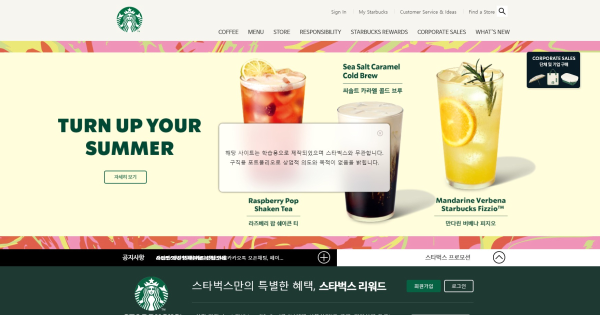
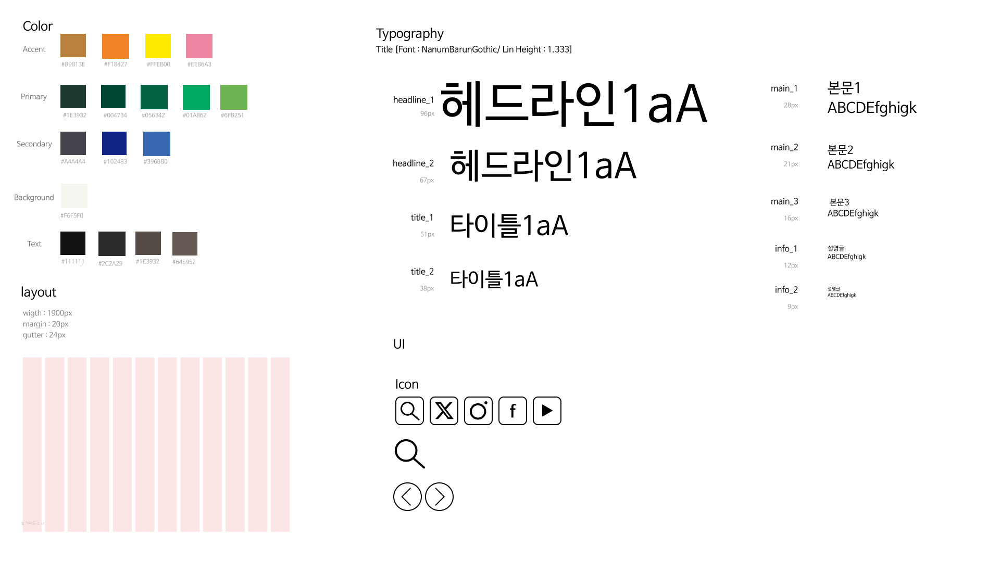

# 프로젝트2 '스타벅스 코리아'

▶ 메인 스크린샷

> 기획서 보기

https://drive.google.com/file/d/1Uz-nOmU1623OvI9Sm14BWAipoWlveS-F/view?usp=drive_link

## 목차

- 기획서 보기
- 스타일 가이드
- 로고 리디자인
- 와이드 프레임
- 리디자인 프로토타입
- 특징
- 브라우저 호환성
- 기술사양
- 연락처

## 스타일 가이드

▶ 사이트를 분석해 만든 스타일 가이드

## 로고 리디자인

▶ 스타벅스의 상징인 별과 사이렌(인어)을 이용해 리디자인

## 리디자인 와이드 프레임

https://user-images.githubusercontent.com/142124095/281629846-e0099518-4e31-40c2-bf27-fa631b800613.jpg

▶ 기본구성

## 리디자인 프로토타입

▶ 리디자인한 프로토타입

## 특징
- parallax

## 브라우저 호환성
- Chrome
- Mozilla
- Opera
- Edge
- Safari

## 기술사양
- HTML5
- CSS3
- jquery-3.1.1.js
- swiper-bundle.min.js

## 연락처

Created By 1618wlsdk@gmail.com